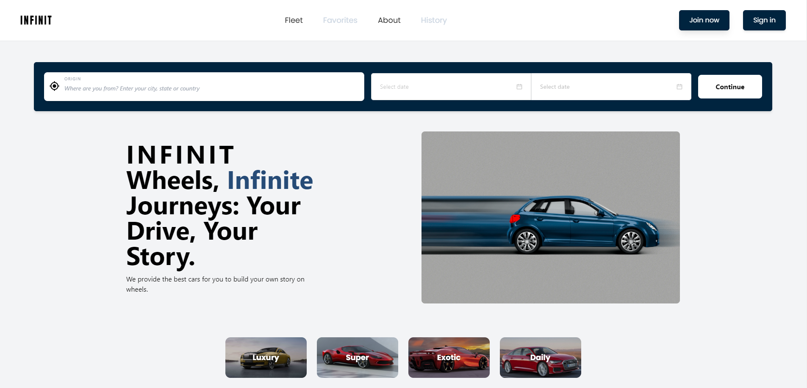

# [INFINIT](https://infinit-ecommerce.vercel.app/)

Project in which I actively contributed with my colleagues where a large human group was formed.

[](https://infinit-ecommerce.vercel.app/)


## Tech Stack
 
- **Framework:** [Next.js](https://nextjs.org)
- **Styling:** [Tailwind CSS](https://tailwindcss.com)
- **ORM:** [Prisma](https://www.prisma.io/)
- **UI Components:** [Emotion](https://emotion.sh/docs/introduction)
                     [MaterialUI](https://mui.com/)
- **Email:** [Nodemailer](https://nodemailer.com/)
- **File Uploads:** [AWS-S3](https://aws.amazon.com/es/s3/?nc=sn&loc=0)


## Features to be implemented

- [x] Newsletter subscription with **Nodemailer**
- [x] ORM using **Prisma**
- [x] Database on **PostgreSQL**
- [x] Storefront with products and categories
- [x] Is responsive
- [ ] Authentication with **Google Auth**
- [ ] File uploads with **AWS-S3**

## Running Locally

1. Clone the repository

   ```bash
   git clone https://github.com/castrojonathand/proyecto-integrador-ecommerce.git
   ```

2. Install dependencies

   ```bash
   npm i
   ```

3. Copy the `.env-example` to `.env` and update the variables.

   ```bash
   cp .env-example .env
   ```

4. Start the development server

   ```bash
   npm run dev
   ```

## How do I deploy this?

Follow the deployment guides for [Vercel](https://create.t3.gg/en/deployment/vercel), [Netlify](https://create.t3.gg/en/deployment/netlify) and [Docker](https://create.t3.gg/en/deployment/docker) for more information.
<!-- 
## Contributing

Contributions are welcome! Please open an issue if you have any questions or suggestions. Your contributions will be acknowledged. See the [contributing guide](./CONTRIBUTING.md) for more information. -->

## Contributors

Thanks goes to these wonderful people for their contributions:

<p align="center">
 <a href="https://github.com/sadmann7/skateshop/graphs/contributors">
   
 </a>
</p>

<p align="center">
 Made with <a rel="noopener noreferrer" target="_blank" href="https://contrib.rocks">contrib.rocks</a>
</p>

